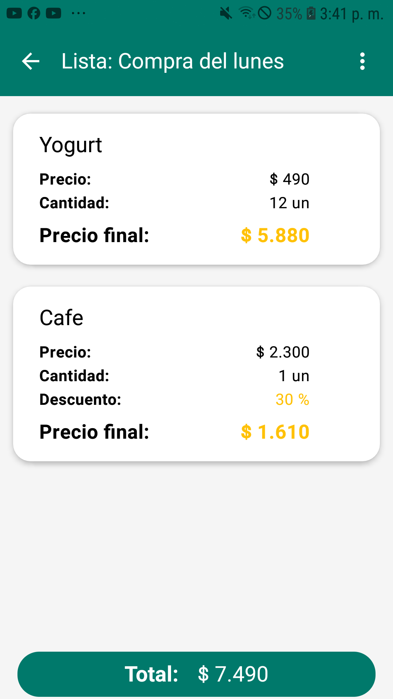
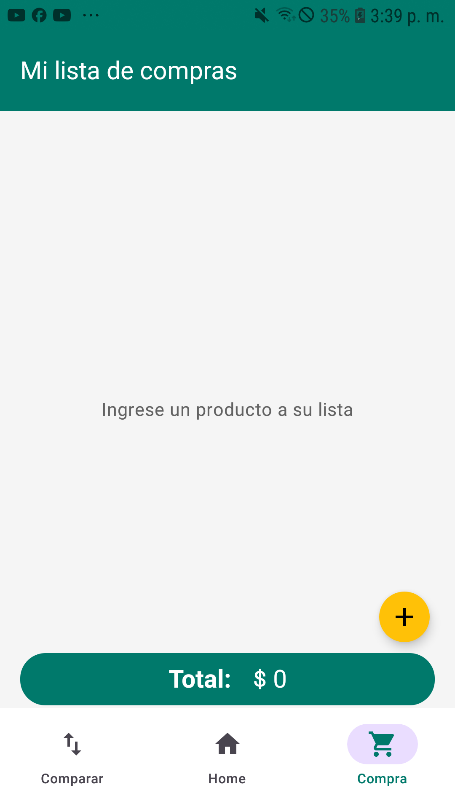
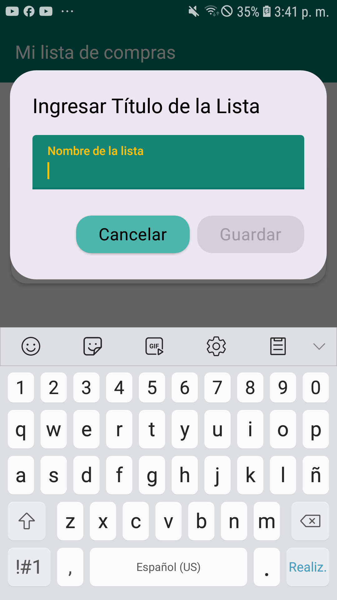
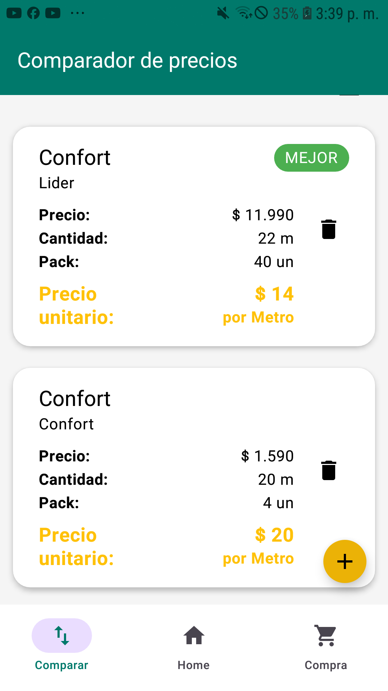
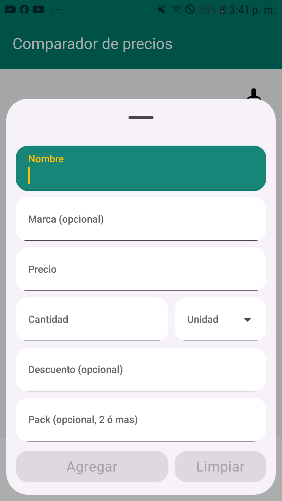

# 🛒 SmartCompra

> Tu asistente inteligente para compras organizadas y económicas.

<div align="center">
  
</div>

## 📄 Descripción y Motivación

**SmartCompra** es una aplicación móvil nativa para Android diseñada para ayudar a los usuarios a tomar decisiones de compra más inteligentes y gestionar sus gastos de manera eficiente.

### La Problemática
En el contexto actual, la variación de precios entre diferentes comercios puede ser confusa. A menudo olvidamos dónde vimos un producto más barato o compramos artículos sin verificar si realmente el precio es conveniente, lo que afecta la economía personal.

### La Solución
SmartCompra centraliza la información, permitiendo registrar precios, compararlos automáticamente para encontrar el mejor valor normalizado y gestionar listas de compras en tiempo real.

El desarrollo de este proyecto surge de la motivación de aplicar conocimientos avanzados de desarrollo Android para resolver un problema cotidiano y tangible.

---

## 📺 Video Técnico

Para ver una demostración completa de la funcionalidad de la aplicación y una explicación técnica de su estructura, visita el siguiente video en YouTube:

<div align="center">

[](https://www.youtube.com/watch?v=9OEIhwL4s9I)

</div>

> Haz clic en la imagen o [aquí para ver el video](https://www.youtube.com/watch?v=9OEIhwL4s9I).

---

## ✨ Características Principales

* **Gestión de Listas de Compras:** Crea y organiza tus listas de supermercado fácilmente.
* **Comparador de Precios Inteligente:** Ingresa dos productos y la app calculará cuál ofrece el mejor valor por unidad de medida.
* **Base de Datos Local:** Funciona sin conexión gracias al almacenamiento local de datos.
* **Interfaz Moderna:** Diseñada siguiendo los principios de Material Design para una experiencia de usuario fluida.

---

## 🛠️ Tecnologías Utilizadas

Este proyecto fue construido utilizando las siguientes tecnologías y herramientas claves para el desarrollo moderno en Android:

* **Lenguaje:** Kotlin
* **UI Toolkit:** Jetpack Compose
* **Arquitectura:** MVVM (Model-View-ViewModel)
* **Inyección de Dependencias:** Hilt
* **Base de Datos Local:** Room Database
* **Navegación:** Compose Navigation
* **Asincronía:** Coroutines y Flow
* **IDE:** Android Studio

---

## 📱 Guía de Instalación y Uso

Sigue estos pasos para ejecutar el proyecto en tu entorno local:

**Prerrequisitos:**
* Android Studio (versión reciente recomendada).
* JDK 11 o superior.

**Pasos:**

1.  **Clonar el repositorio:**
    ```bash
    git clone https://github.com/quirogajqa/Smart_Compra
    ```
2.  **Abrir el proyecto:**
    Abre Android Studio y selecciona "Open an existing project", navegando hasta la carpeta clonada.
3.  **Sincronizar Gradle:**
    Espera a que Android Studio descargue las dependencias y sincronice el proyecto.
4.  **Ejecutar:**
    Conecta un dispositivo físico con depuración USB habilitada o crea un emulador (AVD) y haz clic en el botón "Run" (el triángulo verde).

---

## 📸 Capturas de Pantalla

Explora el flujo de usuario y las principales funcionalidades de **SmartCompra** a través de esta galería de imágenes.

<div align="center">
<table>
  <tr>
    <td align="center">
      
      <br />
      <sub>Home</sub>
    </td>
    <td align="center">
      
      <br />
      <sub>Vista de lista guardada</sub>
    </td>
    <td align="center">
      
      <br />
      <sub>Mi lista de compras</sub>
    </td>
    <td align="center">
      
      <br />
      <sub>Agregar compra</sub>
    </td>
  </tr>
  <tr>
    <td align="center">
      
      <br />
      <sub>Guardar lista</sub>
    </td>
    <td align="center">
      
      <br />
      <sub>Comparador de precios</sub>
    </td>
    <td align="center">
      
      <br />
      <sub>Agregar producto al comparador</sub>
    </td>
    <td align="center">
      
      <br />
      <sub>Logo</sub>
    </td>
  </tr>
</table>
</div>

---

## 👤 Autor

Este portafolio de producto fue desarrollado por:

* **Jhoseph Quiroga** - Desarrollador Android
* [LinkedIn](https://www.linkedin.com/in/jhoseph-quiroga-aa1146114/)
* [GitHub](https://github.com/quirogajqa)

---
*Este proyecto es parte de la evaluación final del módulo de Desarrollo de Portafolio para Especialidades.*
